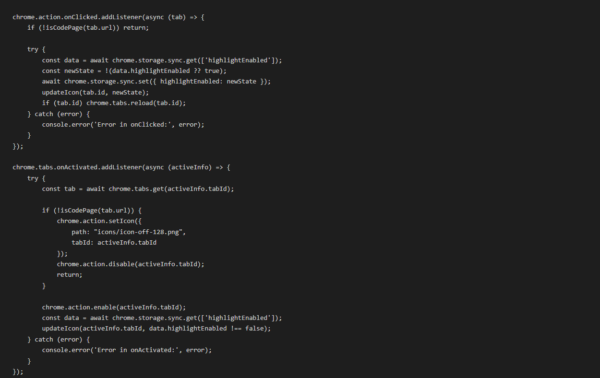
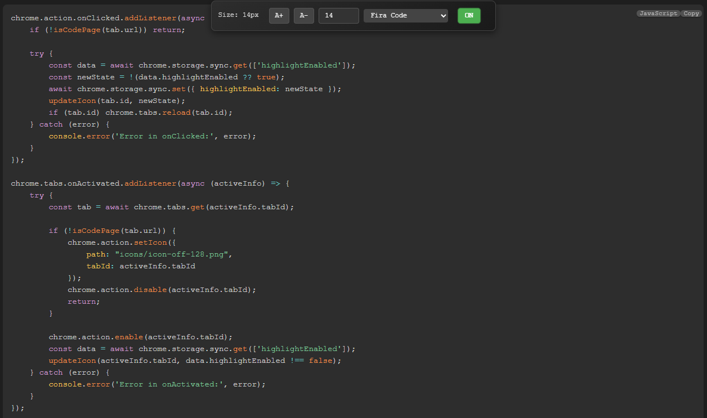
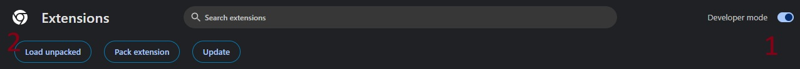
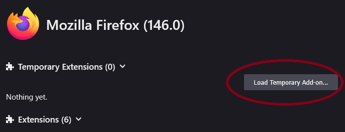

# Local Code Highliter Extention

A browser extension that provides syntax highlighting for code files opened directly in your browser, with customizable font and size controls.

## Features

- Automatic syntax highlighting for 70+ programming languages and file formats
- Customizable font size (8px - 72px)
- Multiple monospace font options including Fira Code, JetBrains Mono, Source Code Pro, and more
- Toggle highlighting on/off via extension icon
- Persistent settings across browser sessions
- Works with both local files and remote URLs
- Clean, modern interface with Prism.js syntax highlighting

## Supported Languages

PHP, JavaScript, TypeScript, Python, Java, C/C++, C#, Ruby, Go, Rust, Swift, Kotlin, Scala, Clojure, R, HTML, CSS, SCSS, SASS, LESS, XML, JSON, SQL, Shell scripts, YAML, TOML, INI, Gradle, Groovy, Dockerfile, Makefile, CMake, Perl, Lua, Vim script, Lisp, Scheme, Haskell, OCaml, F#, Pascal, Puppet, Chef, ERB, Haml, Slim, and more.

## Image

- before



- after



## Installation

### Chrome/Edge
1. Download or clone this repository
2. Open Chrome/Edge and navigate to `chrome://extensions/`
3. Enable "Developer mode" in the top right
4. Click "Load unpacked" and select the extension directory




### Firefox
1. Download or clone this repository
2. Open Firefox and navigate to `about:debugging#/runtime/this-firefox`
3. Click "Load Temporary Add-on"
4. Select the `manifest.json` file from the extension directory



## Usage

1. Open any code file in your browser (e.g., `file:///path/to/file.js` or `https://example.com/script.js`)
2. The extension will automatically detect the file type and apply syntax highlighting
3. Use the controls at the top of the page to:
   - Increase font size (A+ button)
   - Decrease font size (A- button)
   - Enter exact font size (numeric input)
   - Change font family (It must already be installed on your system) (dropdown menu)
4. Click the extension icon in your browser toolbar to toggle highlighting on/off
5. The extension icon will be:
   - Green when highlighting is enabled
   - Gray when highlighting is disabled or on non-code pages

## Settings

All settings are automatically saved and synchronized across your devices:
- Font size
- Font family
- Highlighting enabled/disabled state

## File Structure

```
LocalCodeHighliterExtention/ (Chrome/FireFox)Extention
├── manifest.json          # Extension configuration
├── background.js          # Background service worker
├── content.js             # Content script for highlighting
├── style.css              # Custom styles
├── icons/                 # Extension icons
│   ├── on.png             # Active state icon
│   └── off.png            # Inactive state icon
└── prism/                 # Prism.js library
    ├── prism.js
    └── prism.css
```

## Permissions

- `storage`: To save user preferences
- `tabs`: To detect code file URLs and manage extension state

## Browser Compatibility

- Chrome 109+
- Edge 109+
- Firefox 109+
- Other Chromium-based browsers

## Development

To modify the extension:

1. Edit the relevant files
2. Reload the extension in your browser:
   - Chrome: Visit `chrome://extensions/` and click the reload icon
   - Firefox: Visit `about:debugging#/runtime/this-firefox` and click "Reload"

## Contributing

Contributions are welcome! Please feel free to submit a Pull Request.

## License

This project is open source and available under the MIT License.

## Credits

- Syntax highlighting powered by [Prism.js](https://prismjs.com/)
- Developed by AmirRoox

## Support

If you encounter any issues or have suggestions, please open an issue on GitHub.